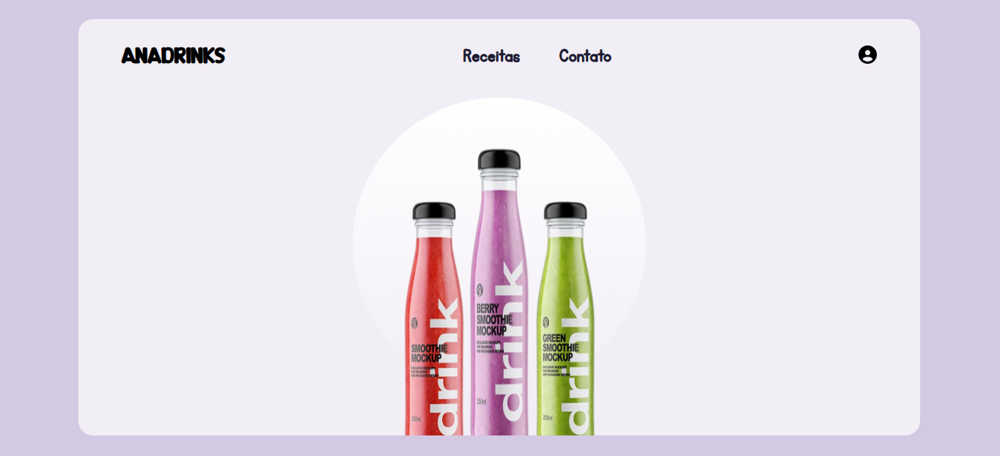

# 🥤 Smoothie Hub

> 

A simple and elegant site for exploring healthy and delicious smoothie recipes!

### Linguagens e Tecnologias

<a href="https://github.com/romhenri/javascript" target="_blank" alt="JavaScript"></a>
<a href="https://github.com/romhenri/html" target="_blank"></a>
<a href="https://github.com/romhenri/css" target="_blank"></a>

### Local Setup

1. Clone this repository  
   ```bash
   git clone https://github.com/rauana-carvalho/smoothie-hub.git
   cd smoothie-hub
   ```
2. Open `index.html` in your browser  
3. Enjoy your favorite recipes!

---

### Contributing

1. Open an **issue** for suggestions  
2. Fork the repo and create a **branch** for your feature  
3. Submit a **pull request**  

---

### Author

[rauanacarvalho](https://github.com/rauanacarvalho)  

⭐ If you like the project, give it a star! ⭐
